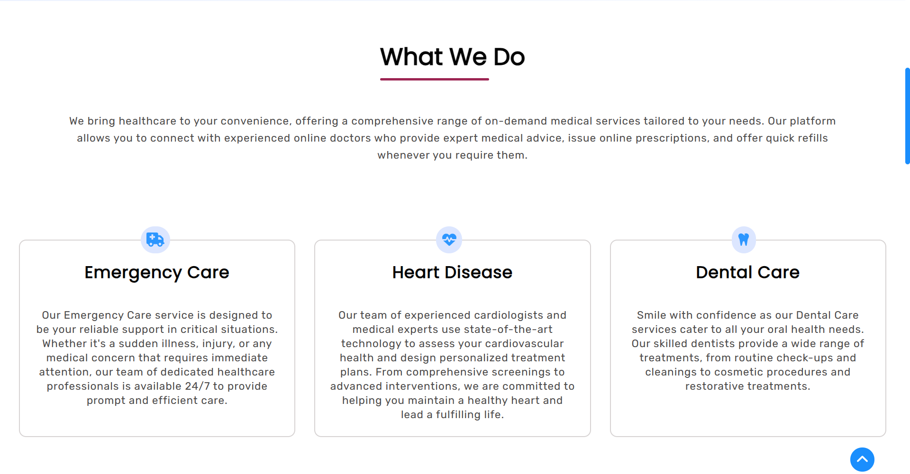

# Health Plus

Welcome to the Health Plus project repository! This is a React-based website aimed at providing accessible and personalized healthcare services to users. The website allows users to connect with expert doctors, schedule appointments, and receive expert medical advice.

## Project Overview

- **Website**: [Health Plus](https://robintech514.github.io/health-plus-react/ "Health Plus")
- **Framework**: React.js
- **Deployment**: GitHub Pages
- **Libraries**: React-Toastify, React Router DOM, FontAwesomeIcon

## Features

- Easily schedule appointments with the specialists.
- Engage in virtual consultations to receive expert medical advice.
- Responsive UI design for seamless user experience across devices.
- Utilizes React-Toastify for notifications, React Router DOM for page routing, and FontAwesomeIcon for icons.
- Deployed using GitHub Pages for easy access and sharing.

## Screenshots

### Hero Section

### Information Section

### About Section

### Why Choose Health Plus?

### Reviews Section

### Doctors Section

### Footer Section

### Legal Documents Page

### Appointment Form Page

## Deployment

The website is deployed using GitHub Pages and can be accessed at [https://robintech514.github.io/health-plus-react/](https://robintech514.github.io/health-plus-react/).

## Contributing

Contributions are welcome! If you find a bug or have a feature request, please open an issue or submit a pull request.

## License

This project is licensed under the [MIT License](./LICENSE "Project LICENSE").
